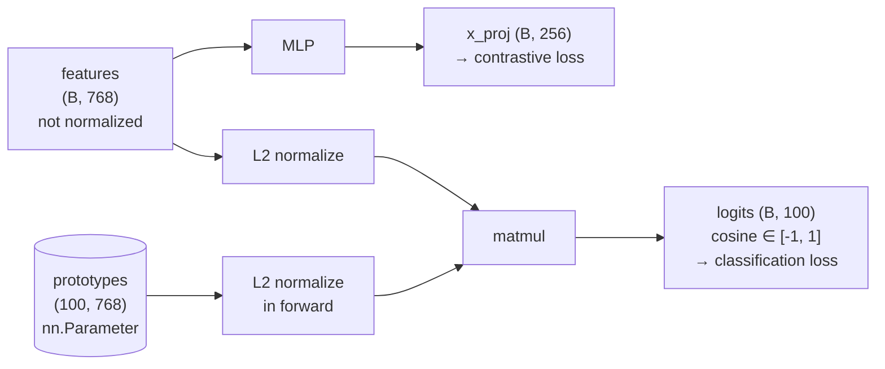

# My implementation notes

## Status
| component | state |
|---|---|
| `data/cifar.py` | done, validated |
| `models/backbone.py` | done, validated |
| `models/head.py` | done, validated |
| `evaluate.py` | in progress |
| `losses/classification.py` | not started |
| `losses/contrastive.py` | not started |
| `train.py` | not started |

## Data flow
### 1. CIFAR100 dataset split
| set | length | contents |
|---|---|---|
| `train_labelled` | 20 000 | classes 0–79 only |
| `train_unlabelled` | 30 000 | 20 000 from classes 0–79 + 10 000 from 80–99 |
| `train_unlabelled_eval` | 30 000 | same indices, test transform |
| `test` | 10 000 | all 100 classes |

Union of the two train sets = 50 000, intersection empty.
Assuming `num_old_classes = 80` and `prop_train_labels = 0.5`.

I use two instances of the CIFAR100 dataset, to apply the train transform and
the eval transform separately. Each split is a subset of one of those
instances. `train_labelled` and `train_unlabelled` are merged further down the
pipeline by `WrapperCIFAR`. The chain is:

`DataLoader -> sampler gives an index -> WrapperCIFAR -> Subset -> the CIFAR100
instance carrying either the train or the eval transform`

### 2. Data loader
Batch contract

```
train loader:
    ([Tensor(128,3,224,224), Tensor(128,3,224,224)],   # list of views
     Tensor(128,)  int64,                              # labels
     Tensor(128,)  bool)                               # mask

    torch.cat(images, dim=0) -> (256,3,224,224)
    view 0 = rows 0..127, view 1 = rows 128..255       # block-wise

eval loader:
    (Tensor(256,3,224,224),
     Tensor(256,) int64)
```

### 3. Backbone
We use DINO ViT-B/16 as a pretrained backbone.

Backbone contract

```
input batch:
     Tensor(B,3,224,224) torch.float32

output features:
     Tensor(B,768) torch.float32
```

ViT-B/16 has 12 transformer blocks (0 to 11). The official implementation sets
`grad_from_block=11`, so only the last block is finetuned.

### 4. Head
Head contract
```
input features:
     Tensor(B, 768) torch.float32

outputs:
     Tensor(B, 256) torch.float32, Tensor(B, 100) torch.float32
```
The first output corresponds to the features projected through an MLP made of three layers of dimensions 768 -> 2048 -> 2048 -> 256 (with GELU activation in between, no batchnorm as in the original code).

The second output corresponds to the cosine similarities in [-1, 1] between each feature vector and each prototype.



## Comparison with the official implementation
- I chose a different file structure, which suits me better than the original
  flat layout.
- The official repo doesn't include test suite. I keep one under tests/, plus asserts at construction time, making the debugging more efficient.
- `ColorJitter()` is called with no arguments. All torchvision defaults are 0,
  so the call is the identity: no color augmentation is actually applied on CIFAR-100.
- I use two separate CIFAR100 instances wrapped in subsets, instead of the
  `deepcopy` the repo relies on. This avoids sharing a `transform` attribute.
- I don't return the original dataset index in `__getitem__`. 
- Instead of reparametrizing the weight matrix of the prototypes, i decided to store the prototypes unnormalized in an `nn.Parameter` of shape `(100, 768)` and to normalize them only during the forward part.
This gives the exact same cosine similarities while being easier to read for me, and avoid deprecated functions.
