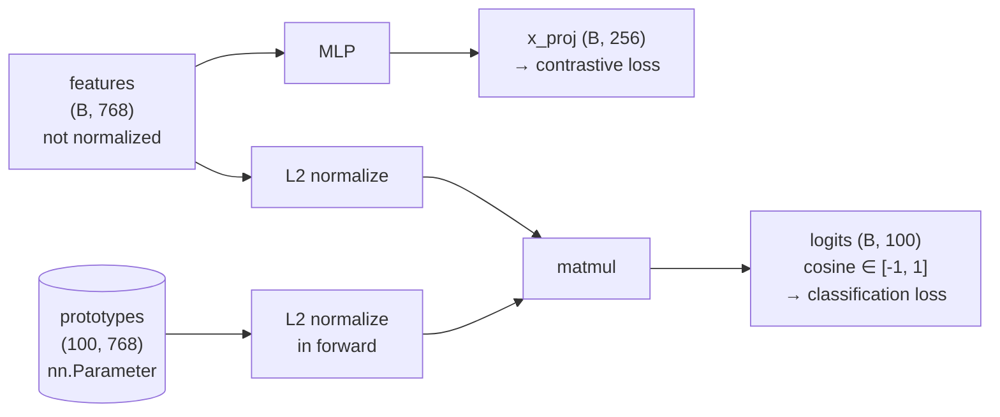

# My implementation notes

## Data flow
### 1. CIFAR100 dataset split
| set | length | contents |
|---|---|---|
| `train_labelled` | 20 000 | classes 0–79 only |
| `train_unlabelled` | 30 000 | 20 000 from classes 0–79 + 10 000 from 80–99 |
| `train_unlabelled_eval` | 30 000 | same indices, test transform |
| `test` | 10 000 | all 100 classes |

Union of the two train sets = 50 000, intersection empty.
Assuming `num_old_classes = 80` and `prop_train_labels = 0.5`.

I use two instances of the CIFAR100 dataset, to apply the train transform and
the eval transform separately. Each split is a subset of one of those
instances. `train_labelled` and `train_unlabelled` are merged further down the
pipeline by `WrapperCIFAR`. The chain is:

`DataLoader -> sampler gives an index -> WrapperCIFAR -> Subset -> the CIFAR100
instance carrying either the train or the eval transform`

### 2. Data loader
Batch contract

```
train loader:
    ([Tensor(128,3,224,224), Tensor(128,3,224,224)],   # list of views
     Tensor(128,)  int64,                              # labels
     Tensor(128,)  bool)                               # mask

    torch.cat(images, dim=0) -> (256,3,224,224)
    view 0 = rows 0..127, view 1 = rows 128..255       # block-wise

eval loader:
    (Tensor(256,3,224,224),
     Tensor(256,) int64)
```

### 3. Backbone
We use DINO ViT-B/16 as a pretrained backbone.

Backbone contract

```
input batch:
     Tensor(B,3,224,224) torch.float32

output features:
     Tensor(B,768) torch.float32
```

ViT-B/16 has 12 transformer blocks (0 to 11). The official implementation sets
`grad_from_block=11`, so only the last block is finetuned.

### 4. Head
Head contract
```
input features:
     Tensor(B, 768) torch.float32

outputs:
     Tensor(B, 256) torch.float32, Tensor(B, 100) torch.float32
```
The first output corresponds to the features projected through an MLP made of three layers of dimensions 768 -> 2048 -> 2048 -> 256 (with GELU activation in between, no batchnorm as in the original code).

The second output corresponds to the cosine similarities in [-1, 1] between each feature vector and each prototype.


```mermaid
flowchart LR
    x["features<br/>(B, 768)<br/>not normalized"]

    x --> mlp["MLP"]
    mlp --> proj["x_proj (B, 256)<br/>→ contrastive loss"]

    x --> nx["L2 normalize"]
    P[("prototypes<br/>(100, 768)<br/>nn.Parameter")] --> nP["L2 normalize<br/>in forward"]
    nx --> lin["matmul"]
    nP --> lin
    lin --> logits["logits (B, 100)<br/>cosine ∈ [-1, 1]<br/>→ classification loss"]
```

### 5. Model
The `Model` class is simply wrapping the provided backbone and head into one `torch.nn.Module` subclass.

### 6. Loss
#### 6.1 Classification loss
I implemented the classification loss described in eq. (4) of the paper.  
The function `loss_classification` returns the supervised and unsupervised classification loss that are then combined in the training loop.

```
inputs:
     Tensor(2B, 100) torch.float32 the raw cosine logits of the head with the
                                   first B rows corresponding to the first view and the last B rows corresponding to the second view
     Tensor(B, ) torch.int64 the labels of each image
     Tensor(B, ) torch.bool if they are labelled
     tau_s, tau_t, epsilon floats of the configuration file

output:
     dict with keys 'L_cls_u', 'L_cls_s', 'logs'
```

Note : the teacher logits are detached so that the student learns to predict the teacher as a fixed target at each step. I detached the logs to prevent from keeping each graph alive and running out of memory.

#### 6.2 Representation loss
Similarly, `loss_representation` returns the supervised and unsupervised representation loss.
```
inputs:
     Tensor(2B, 256) torch.float32 the raw projected features of the head with the
                                   first B rows corresponding to the first view and the last B rows corresponding to the second view
     Tensor(B, ) torch.int64 the labels of each image
     Tensor(B, ) torch.bool if they are labelled
     tau_u, tau_c floats of the configuration file

output:
     dict with keys 'L_rep_u', 'L_rep_s'
```

I rewrote the implementation of the representation loss in order to (1) stay closer to the mathematical expression of the loss for understandability (2) avoid using two different functions for supervised and unsupervised loss (3) avoid the generic SupCon code.

The core logic of the contrastive loss is implemented in `contrastive_loss`. The function computes :

$$\mathcal{L} = \frac{1}{N}\sum_{i=1}^{N} -\frac{1}{|P(i)|}\sum_{p \in P(i)} \log \frac{\exp(z_i^\top z_p/\tau)}{\sum_{k \neq i}\exp(z_i^\top z_k/\tau)}, \qquad \|z_i\| = 1$$

The unsupervised and supervised loss simply use different $P(i)$ masks. The unsupervised loss uses the other view of the same image, whereas the supervised loss uses all labelled samples with the same label in both views, excluding itself. 

### 7. Evaluate
I provide the function `evaluate(model, loader, num_old, device)` that returns the accuracies of total, old and new classes.  
As in the paper, I report the accuracies computed after the last training epoch. The evaluation makes one pass over the whole `train_unlabelled_eval` dataset. 

Note : the total accuracy is weighted by the number of old and new class samples (so 2/3 and 1/3).

### 8. Training
#### 8.1 Training loop
- The two views yielded by the dataloader are concatenated on GPU to allow for asynchronous loading of the batch.
- The `config.py` files allows for an extra argument `stop_after_epochs`, so that the schedulers (learning rate and teacher temperature) are computed with `num_epochs` but the training actually stops earlier for debugging.

### 8.2 Optimizer
- The weight decay filters on the dimension of parameters to exclude LayerNorm and biases (for which ndim == 1)
- We also apply regularization to the prototypes to allow their norms to converge (see comparison section) 

### 8.3 Precision
The numerical precision is automatically chosen among `fp32`, `fp16`, `bf16` for portability.  
If the precision is set to `fp16` we use `torch.amp.GradScaler` to avoid gradients from being rounded to 0.

### 8.4 Checkpoints and portability
The checkpoint only saves trainable parameters for efficient disk usage.   
We also save the rng states to get the same results when resuming training (exact same bit on CPU). 
The logs also include the commit of the current version and if the folder was modified (`dirty`).

### 8.5 Throughput
Every `print_freq` iteration I compute `t_data` the time waiting the next batches and `t_compute` the computation time of the GPU. This allows to choose the infrastructure more wisely. I used `torch.cuda.synchronize` since cuda is asynchronous.

## Comparison with the official implementation
- I chose a different file structure, which suits me better than the original
  flat layout.
- The official repo doesn't include test suite. I keep one under tests/, plus asserts at construction time, making the debugging more efficient.
- `ColorJitter()` is called with no arguments. All torchvision defaults are 0,
  so the call is the identity: no color augmentation is actually applied on CIFAR-100.
- I use two separate CIFAR100 instances wrapped in subsets, instead of the
  `deepcopy` the repo relies on. This avoids sharing a `transform` attribute.
- I don't return the original dataset index in `__getitem__`. 
- Instead of reparametrizing the weight matrix of the prototypes, i decided to store the prototypes unnormalized in an `nn.Parameter` of shape `(100, 768)` and to normalize them only during the forward part.
This gives the exact same cosine similarities while being easier to read for me, and avoid deprecated functions.
- I reimplemented only one way of computing metrics on accuracy (`split_cluster_acc_v2` in the original code, that i renamed `acc_metrics`) as it's the one used for the paper's results.
- My calculation of the entropy in `losses/classification` differs from the one in the original code by a constant $\log K$ which doesn't affect the gradient descent. I followed my understanding of entropy from physics classes.
- I used torch.roll instead of a nested loop to compute the unsupervised classification loss for readability.
- I used the student temperature of the `config.py` file instead of hardcoding it.
- It seems that there is a discrepancy between the paper mentioning $\tau_u = 0.07$, $\tau_c = 1.0$ and the code where the two values are swapped. I followed the code implementation.
- As described in section 6.2, I modified the logic of the implementation of the representation loss.
- I used `.to(device)` instead of `.cuda()` to allow for debugging on CPU.
- I added a `eval_freq` parameter to the configuration, which can save two to three hours of training time.
